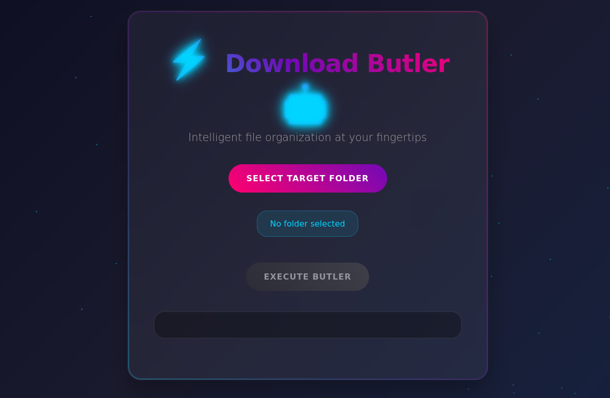
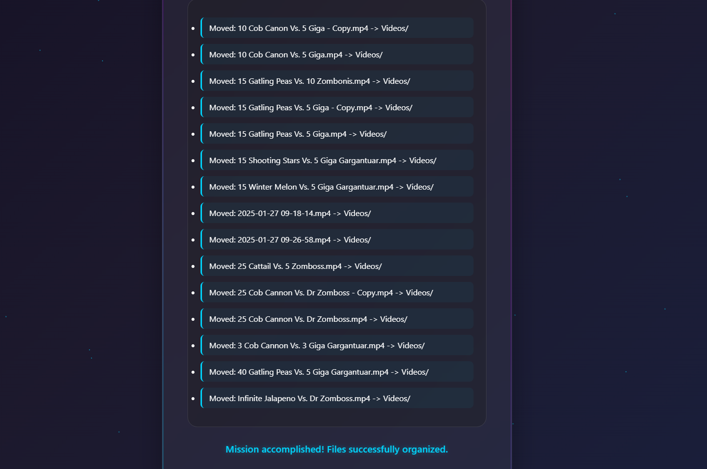

# Downloads Butler

**“Your silent assistant that keeps your Folder tidy.”**

Downloads Butler is a smart, cross-platform desktop app that automatically organizes your messy Downloads folder by file type. Built with **Electron** and Node.js, it’s lightweight, fast, and fully customizable.

---

## Features

- Automatically organizes your Folder into categorized subfolders
- File type rules configurable via `config.json`
- Clean, minimal UI with one-click operation
- Supports **Windows**, **Linux**, and **WSL environments**
- **Smart Sorting Logic**: Prevents false duplicates by sorting longer filenames first (e.g., avoids "file" being moved before "file (copy)")
- **Duplicate File Cleaner**: Detects and skips moving duplicate files (e.g., avoids file.pdf vs file (1).pdf clashes)
- Built using **Electron**, **Node.js**, and the **File System API**
- Cross-Platform Support: Works on Windows, Linux, and WSL environments
- **Wide Extension Support**: Comes preloaded with rules for 30+ file extensions
- Supports dozens of file extensions out-of-the-box
- Works offline — no internet required

---

## Supported Extensions (by default)

PDF, DOCX, MP3, MP4, EXE, ZIP, PNG, JPG, TXT, CSV, PPTX, JSON, XML, MD, SVG, and many more.
- Want more? Just edit `config.json` and add your own rules.

## Keywords (for discoverability)

`electron downloads organizer`, `node.js file sorter`, `desktop file automation`,  
`linux electron app`, `downloads folder cleaner`,`folder cleaner`, `auto file mover`,  
`file categorizer`, `windows file manager`, `productivity tool`,  
`electron WSL app`, `file cleanup tool`, `cross-platform file organizer`

---

## 🛠 Installation & Build Instructions

### Build `.exe` for Windows (from WSL or native):

```bash
 npm install
 npm run build-win
```
After running the build command, your Windows installer (.exe) will be generated in the `dist/` folder.
Simply double-click the .exe file to install Downloads Butler on your system.

## Screenshots
### Main UI


### After Organizing


## Features to be Added:
 - Intelligent categorization based on file content

